# 🚀 Sistema de Contexto Automatizado Élite

Este sistema implementa el patrón que usan los equipos élite para **automatizar la carga de contexto fresco** sin tener que repetir "consulta Context7" constantemente.

## 🎯 **¿Qué Resuelve?**

- ✅ **Elimina la fricción** de tener que recordar consultar fuentes frescas
- ✅ **Automatiza la carga** de contexto desde múltiples fuentes
- ✅ **Cachea inteligentemente** para optimizar rendimiento
- ✅ **Se actualiza automáticamente** cada 6 horas
- ✅ **Inyecta contexto fresco** en cada sesión automáticamente

## 🏗️ **Arquitectura**

```mermaid
graph TD
    A[Usuario hace pregunta] --> B[Middleware de Contexto]
    B --> C{¿Contexto fresco?}
    C -->|No| D[Fetch Context7 + APIs]
    C -->|Sí| E[Usar caché]
    D --> F[Cloudflare KV Cache]
    E --> G[Inyectar contexto]
    F --> G
    G --> H[Respuesta con contexto fresco]

    I[Cron Job] --> J[Actualizar contexto cada 6h]
    J --> F
```



## 🚀 **Endpoints Disponibles**

### **GET /api/context**
Obtiene contexto fresco para los temas especificados.

```bash
# Obtener contexto para Next.js y Supabase
curl "https://api.fascinantedigital.com/api/context?topics=nextjs,supabase"

# Forzar actualización
curl "https://api.fascinantedigital.com/api/context?topics=nextjs,supabase&forceRefresh=true"
```

**Respuesta:**
```json
{
  "contexts": [
    {
      "source": "Next.js Documentation",
      "data": {
        "version": "15.x",
        "lastUpdated": "2025-01-27T10:30:00Z",
        "features": ["App Router", "Server Components", "Middleware"],
        "url": "https://nextjs.org/docs"
      },
      "timestamp": 1738068600000,
      "cached": false
    }
  ],
  "cached": false,
  "timestamp": 1738068600000
}
```

### **GET /api/context/prompt**
Genera un prompt listo para usar con contexto fresco.

```bash
curl "https://api.fascinantedigital.com/api/context/prompt?topics=nextjs,supabase"
```

**Respuesta:**
```json
{
  "prompt": "# CONTEXTO FRESCO AUTOMATIZADO\n\n**Última actualización:** 27/01/2025, 10:30:00\n\n## Next.js Documentation\n- **Versión:** 15.x\n- **Última actualización:** 2025-01-27T10:30:00Z\n- **Características:** App Router, Server Components, Middleware\n- **URL:** https://nextjs.org/docs\n\n**INSTRUCCIONES:** Usa esta información fresca para responder. Prioriza estos datos sobre cualquier conocimiento base que puedas tener.\n\n"
}
```

### **POST /api/context/refresh**
Refresca todos los contextos manualmente.

```bash
curl -X POST "https://api.fascinantedigital.com/api/context/refresh"
```

### **GET /api/context/stats**
Obtiene estadísticas del caché.

```bash
curl "https://api.fascinantedigital.com/api/context/stats"
```

## 🎣 **Hooks de React**

### **useContext()**
Hook principal para usar contexto automatizado.

```tsx
import { useContext } from '@/lib/hooks/use-context';

function MyComponent() {
  const { context, loading, error, refreshContext, isStale } = useContext({
    topics: ['nextjs', 'supabase'],
    autoRefresh: true,
    refreshInterval: 300000 // 5 minutos
  });

  if (loading) return <div>Cargando contexto...</div>;
  if (error) return <div>Error: {error}</div>;

  return (
    <div>
      <h2>Contexto Fresco</h2>
      {context?.contexts.map((ctx, index) => (
        <div key={index}>
          <h3>{ctx.source}</h3>
          <p>Versión: {ctx.data.version}</p>
          <p>Actualizado: {new Date(ctx.timestamp).toLocaleString()}</p>
        </div>
      ))}

      {isStale && (
        <button onClick={refreshContext}>
          Actualizar Contexto
        </button>
      )}
    </div>
  );
}
```

### **useContextPrompt()**
Hook específico para obtener prompts con contexto.

```tsx
import { useContextPrompt } from '@/lib/hooks/use-context';

function ChatComponent() {
  const { prompt, loading, error } = useContextPrompt(['nextjs', 'supabase']);

  if (loading) return <div>Generando prompt...</div>;

  return (
    <div>
      <h3>Prompt con Contexto Fresco:</h3>
      <pre className="bg-gray-100 p-4 rounded">
        {prompt}
      </pre>
    </div>
  );
}
```

### **useContextStats()**
Hook para estadísticas del caché.

```tsx
import { useContextStats } from '@/lib/hooks/use-context';

function StatsComponent() {
  const { stats, loading } = useContextStats();

  if (loading) return <div>Cargando estadísticas...</div>;

  return (
    <div>
      <h3>Estadísticas del Caché</h3>
      <p>Total de fuentes: {stats?.totalSources}</p>
      <p>Última actualización: {new Date(stats?.lastRefresh).toLocaleString()}</p>

      {Object.entries(stats?.sources || {}).map(([key, source]: [string, any]) => (
        <div key={key}>
          <strong>{key}:</strong> {source.cached ? '✅ Caché' : '❌ No caché'}
          {source.valid ? ' ✅ Válido' : ' ⚠️ Expirado'}
        </div>
      ))}
    </div>
  );
}
```

## 🔧 **Configuración**

### **1. Cloudflare KV**
Crear namespaces de KV en Cloudflare:

```bash
# Crear namespace para producción
wrangler kv:namespace create "CONTEXT_KV"

# Crear namespace para preview
wrangler kv:namespace create "CONTEXT_KV" --preview
```

### **2. Variables de Entorno**
Agregar a tu `.env.local`:

```env
CONTEXT_API_URL=https://api.fascinantedigital.com
NEXT_PUBLIC_CONTEXT_API_URL=https://api.fascinantedigital.com
```

### **3. Deploy del Worker**
```bash
cd apps/api
wrangler deploy
```

## 🎯 **Casos de Uso**

### **1. Chat con Contexto Fresco**
```tsx
function ChatInterface() {
  const { prompt } = useContextPrompt(['nextjs', 'supabase']);

  const sendMessage = async (message: string) => {
    const fullPrompt = `${prompt}\n\nUsuario: ${message}`;

    // Enviar a tu API de chat con contexto fresco
    const response = await fetch('/api/chat', {
      method: 'POST',
      body: JSON.stringify({ prompt: fullPrompt })
    });

    return response.json();
  };

  return (
    <div>
      {/* Tu interfaz de chat */}
    </div>
  );
}
```

### **2. Documentación Dinámica**
```tsx
function DocumentationPage() {
  const { context } = useContext({ topics: ['nextjs'] });

  return (
    <div>
      <h1>Documentación Next.js</h1>
      <p>Última actualización: {context?.contexts[0]?.data.lastUpdated}</p>

      {/* Mostrar documentación basada en contexto fresco */}
    </div>
  );
}
```

### **3. Dashboard de Contexto**
```tsx
function ContextDashboard() {
  const { stats } = useContextStats();
  const { refreshAllContexts } = useContext();

  return (
    <div>
      <h2>Dashboard de Contexto</h2>

      <button onClick={refreshAllContexts}>
        Actualizar Todos los Contextos
      </button>

      <ContextDisplay topics={['nextjs', 'supabase', 'cloudflare']} />
    </div>
  );
}
```

## 🚀 **Beneficios Élite**

| Antes (Usuario Común) | Después (Sistema Élite) |
|------------------------|---------------------------|
| "Consulta Context7" cada vez | Contexto fresco automático |
| Información desactualizada | Datos actualizados cada 6h |
| Fricción en cada consulta | Experiencia fluida |
| Dependencia del modelo base | Fuentes dinámicas integradas |
| Proceso manual | Automatización completa |

## 🔄 **Actualización Automática**

El sistema se actualiza automáticamente cada 6 horas usando Cloudflare Cron Triggers:

```toml
# wrangler.toml
[[triggers]]
crons = ["0 */6 * * *"] # Cada 6 horas
```

## 🎯 **Próximos Pasos**

1. **Integrar Context7 API** cuando esté disponible
2. **Agregar más fuentes** (React, TypeScript, etc.)
3. **Implementar análisis** de uso de contexto
4. **Crear dashboard** de administración
5. **Optimizar caché** con estrategias avanzadas

---

**¡Ya no tendrás que decir "consulta Context7" nunca más!** 🚀

